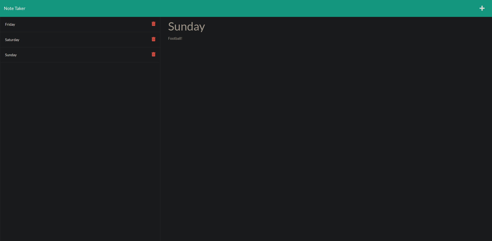

# Note Taker
## Purpose
  A website to take and store notes with!
  
## Installation
 * Clone the repository to your preffered development environment.
 * Run npm install to install all dependencies. 
 
## Usage
 * To use the application locally type <code>npm start</code> or <code>node server.js</code> in your terminal.
 * Navigate to <link>http://localhost:3001</link> in your browser to use the project live.

## Built With
* JavaScript
* Express
* Node.js

## Website Screenshot

## Heroku page
[Note Taker website](https://damp-brook-74725.herokuapp.com/)

## Credits
Made by Mike Bashford
